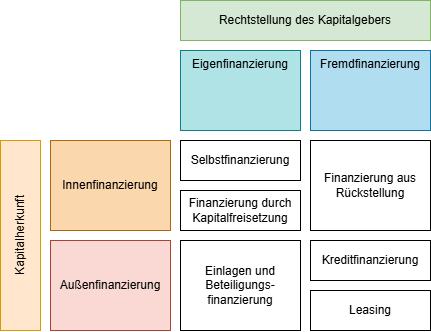
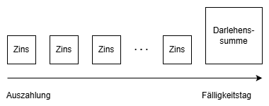
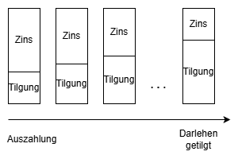
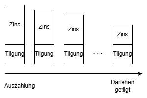

# Finanzierung

Finanzierung umfasst alle Maßnahmen in einem Unternehmen die mit der Kapitalbeschaffung verbunden sind. Das Kapital kann dabei in Form von Geld, Gütern oder Wertpapieren bereitgestellt werden.

## Finanzierungsarten

### Selbstfinanzierung

### Finanzierung durch Kapitalfreisetzung

### Finanzierung aus Rückstellung

### Einlagen und Beteiligungsfinanzierung

Einlagen durch Eigentümer oder Gesellschafter die z.B. das Erhöhen des Stammkapitals, die Aufnahme neuer Gesellschafter oder die Ausgabe neuer Aktien beinhalten.

### Kreditfinanzierung

Gläubigerkapital wird in der Form von Krediten (Überlassung von Geld oder vertretbaren Sachen) i.d.R. gegen Sicherheiten bereitgestellt. Diese Sicherheiten kann der Gläubiger (Kreditgeber) verwerten falls der Schuldner (Kreditnehmer) seinen Verpflichtungen nicht nachkommt.

Kreditarten sind dabei:

#### Lieferantenkredit

Der Lieferer räumt seinem Kunden ein Zahlungsziel ein.

#### Dispositionskredit / Kontokorrentkredit

Typischerweise Kreditinstitute wie Banken aber auch Lieferer können ihren Kunden auf ihrem Girokonto (Privat) oder Kontokorrentkonto (Gewerblich) einen Kreditrahmen einräumen, den die Kunden jederzeit in Anspruch nehmen können indem sie ihr Konto überziehen.

#### Ratenkauf / Teilzahlung

Verkäufer und Kunde vereinbaren, den gesamten Rechnungsbetrag in Teilbeträgen zu bezahlen. Der Käufer erhält die Ware sofort, wird aber erst nach vollständiger Bezahlung Eigentümer. In die Raten werden bereits die Zinsen eingerechnet. Ratenkäufe mit Privatpersonen müssen schriftlich abgeschlossen werden. Darüber hinaus haben sie ein Widerrufsrecht, über das sie informiert werden müssen. Sie können den Vertrag binnen 14 Tagen nach Vertragsabschluss widerrufen.

#### Darlehen

Ein Langfristiger Kredit wird auch Darlehen genannt. Zum Darlehen gehört ein Zinssatz welcher i.d.R. für mehrere Jahre festgelegt wird und eine Tilgung, also wie das Darlehen zurückgezahlt wird.

Es ergeben sich folgende Darlehensarten:

##### Fälligkeitsdarlehen

Die Tilgung erfolgt am Ende der Laufzeit. Während der Laufzeit werden lediglich die Zinsen gezahlt.

##### Annuitätendarlehen

Die Tilgung erfolgt kontinuierlich zur Laufzeit. Die Rate bleibt dabei konstant. Dafür sinken die Zinsen mit jedem Tilgungsbetrag und der Tilgungsanteil steigt.

##### Abzahlungsdarlehen

Die Tilgung erfolgt kontinuierlich zur Laufzeit mit konstanten Tilgungsbeträgen. Da auch hier die Zinsen mit jedem Tilgungsbetrag sinken, sinkt auch die Rate kontinuierlich.

### Leasing
