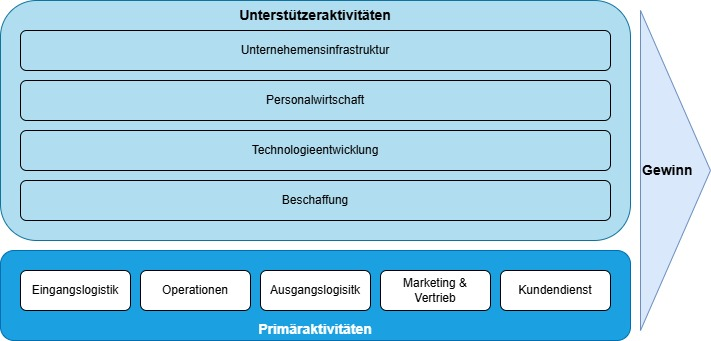

# Wertschöpfungskette

## Definition

Alle Aktivitäten, die ein Produkt oder eine Dienstleistung von der Herstellung bis zur Verwendung durchläuft und dabei Wert erzeugt oder Ressourcen verbraucht.

## Erklärung

Das Grundmodell nach Michael Porter unterscheidet zwischen **Primäraktivitäten**, welche direkt an der Wertschöpfung beteiligt sind, und **Unterstützungsaktivitäten**, welche vorauszusetzen sind, um die Primäraktivitäten zu unterstützen und parallel zur Wertschöpfung verlaufen.

_Wertschöpfungskette nach Porter_

**Primäraktivitäten**:

- Eingangslogistik: Empfang, Lagerung und Verteilung von Rohstoffen
- Operationen/Produktion: Verarbeitung, Qualitätssicherung und Verpackung
- Ausgangslogistik: Sammlung, Lagerung und Lieferung
- Marketing & Vertrieb: Werbung, Verkaufsstrategien, Vertriebskanäle und Preispolitik
- Kundendienst: Serviceleistungen (z.B. Reparaturen, Support, Beratung und Ersatzlieferung)

**Unterstützungsaktitäten**:

- Unternehmensinfrastruktur: Organisation, Verwaltung, Finanzplanung und Geschäftsführung
- Personalwirtschaft: Rekrutierung, Vergütung und Weiterbildung von Mitarbeitern
- Technologieentwicklung: Optimierung von Produktionsprozessen und Einsatz neuer Technologien
- Beschaffung: Einkauf von Rohstoffen, Ausrüstung, Maschinen o.Ä.
